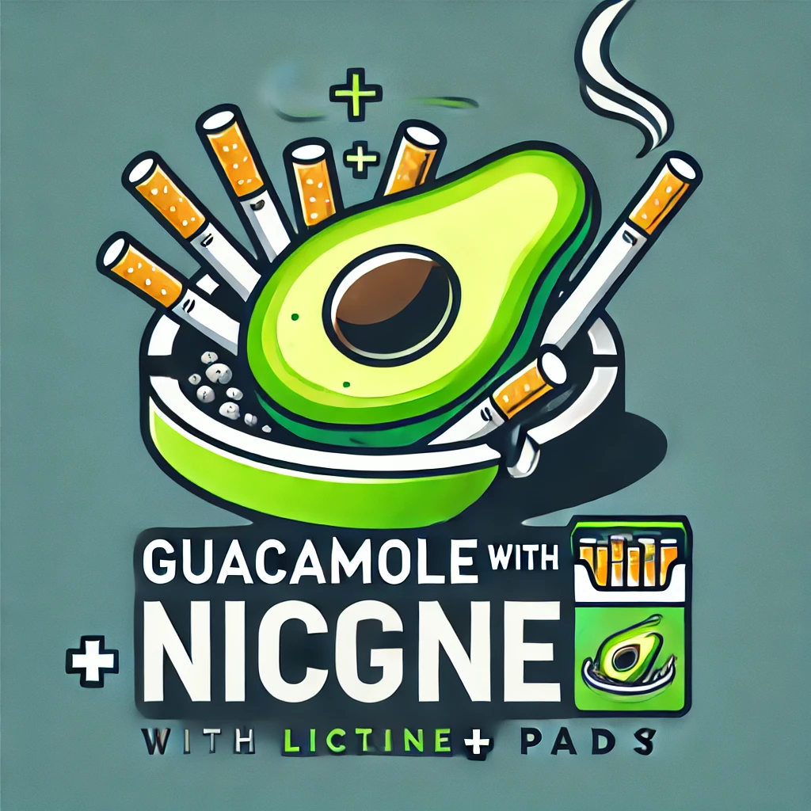

# Guacamole with Nicotine+ Client



This project sets up a Guacamole server with an Alpine Linux-based VNC client running Nicotine+ (a Soulseek client) in fullscreen mode. The entire setup is containerized using Docker and orchestrated with Docker Compose.

## Components

- **Alpine Client**: A lightweight Alpine Linux container with VNC access and Nicotine+ installed.
- **Guacamole**: Web application providing remote desktop access.
- **guacd**: Guacamole proxy daemon.
- **PostgreSQL**: Database for Guacamole.
- **pgAdmin**: Web-based PostgreSQL administration tool.
- **Nginx**: Reverse proxy for Guacamole.

## Prerequisites

- Docker
- Docker Compose

## Setup

1. Clone this repository:
   ```
   git clone https://github.com/profikid/guacamole-with-nicotine-plus
   cd guacamole-with-nicotine-plus
   ```

2. Build and start the containers:
   ```
   docker-compose up -d --build
   ```

3. Access Guacamole at `http://localhost:80`

4. Log in with the default credentials:
   - Username: guacadmin
   - Password: guacadmin

   **Important**: Change these credentials after first login.

5. The Nicotine+ VNC connection should be preconfigured and available.

## Usage

1. After logging in, click on the "Nicotine+" connection to connect to the Nicotine+ client.

2. Nicotine+ will start automatically in fullscreen mode.

3. Configure Nicotine+ with your Soulseek credentials and desired settings.

## Ports

- Guacamole Web Interface: 80
- VNC: 5900
- Nicotine+: 2234-2239
- PostgreSQL: 5432
- pgAdmin: 5050

## Notes

- The VNC password is set to "password". Change this in the Dockerfile for better security.
- This setup is for demonstration purposes. In a production environment, implement proper security measures.
- Nicotine+ is installed in a Python virtual environment within an Alpine Linux container.
- The `.local` directory for Nicotine+ is mounted as a volume to persist configuration and data.
- Downloaded files are stored in the `./downloads` directory on the host machine.

## Legal Considerations

Using Soulseek and similar P2P networks may have legal implications depending on your jurisdiction and the content you're sharing. Ensure you comply with all relevant laws and regulations.

## Troubleshooting

If you encounter issues:
1. Check Docker logs: `docker-compose logs`
2. Ensure all ports are correctly mapped and not in use by other services.
3. Verify your firewall settings allow the required connections.
4. If Nicotine+ doesn't start, try connecting to the VNC session and starting it manually to see any error messages.

## Customization

- Modify `docker-compose.yml` to change service configurations.
- Edit `nginx.conf` to adjust the Nginx reverse proxy settings.
- Update `Dockerfile` to customize the Alpine client or Nicotine+ installation.

## Contributing

Contributions are welcome! Please feel free to submit a Pull Request.

## License

This project is open source and available under the [MIT License](LICENSE).
